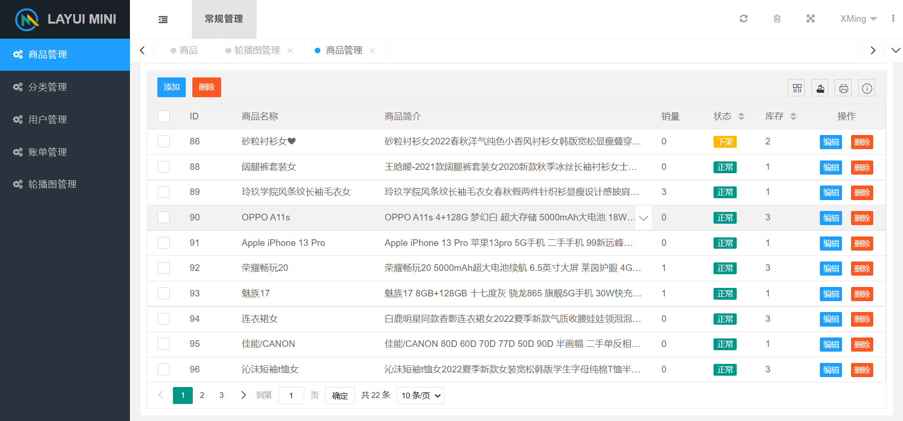

Java电商后端项目（自己的毕业项目），基于Springboot、MybatisPlus、jwt为核心开发的前后端分离的电商项目，该仓库的为Java后端的代码和后台管理系统，前端仓库见：
## 前言
该电商项目是一个基于传统技术框架的项目，适合新手入门。包括订单模块、商品模块、用户模块、评论模块、购物车模块、支付模块的等。
## 技术选型

|技术|版本|
|---|---|
|SpringBoot|2.1.6.RELEASE|
|mybatisPlus|3.5.1|
|druid|1.1.18|
|swagger|2.8.0|
|fastjson|1.2.49|
|hutool|5.7.22|
|layui|~|

## 相关截图

##部署：
1. 修改pox.xml中的内容（sms、oss、mysql等）
2. 创建一个名为suse_shops的数据库执行resources目录下的sql文件
3. 启动项目（默认端口为8080）
4. 查看接口文档(swagger)是否可以访问、后台系统是否可以访问【http://127.0.0.1:8080/login】
5. 后台系统的账号密码默认为：
    - 账号：1828089627
    - 密码：123
## 在线演示地址: